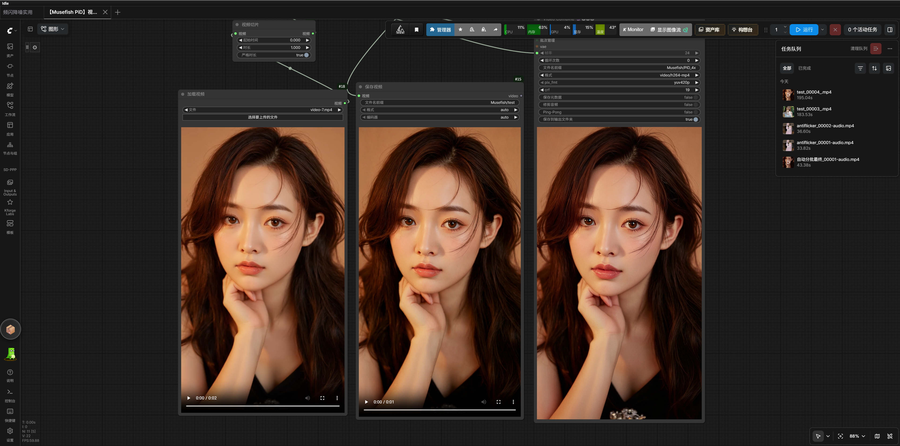

# ComfyUI-Musefish-Nodes

ComfyUI 节点集合：PiD 视频批处理超分 + 自动分批的频闪抑制与频率分离锐化后处理。

- `AutoBatchAntiflicker`：时间双边滤波去频闪，自动分批 + CPU 卸载
- `AutoBatchImageSharpenFS`：频率分离锐化（hard/linear light），自动分批 + CPU 卸载
- `MusefishPiDBatchVideoUpscale`：PiD 视频超分

示例模板工作流：`workflows/Musefish_PiD_Batch_Video_Upscale.json`（UUID：`d7de7df1-0bb0-4cf8-bb1e-6f7ee7c5d1d2`）。
该模板在 PiD 输出后接入 `AutoBatchAntiflicker`，再进行自适应锐化与视频合并。

## AutoBatch Antiflicker

节点 ID：`AutoBatchAntiflicker`

功能：对 `IMAGE` 帧批次执行前后帧对称、亮度引导的时间双边滤波，抑制局部频闪，同时拒绝运动边缘，避免单向时间递归造成拖影。实现位于 `musefish_nodes.py`，不依赖或修改 `VideoHelperSuite`。

### 自动分批与设备卸载

- 滤波张量运算在所选设备（GPU 或 CPU）上执行，输入帧按块搬运、处理完搬回输入所在设备，下游行为不变。
- **自动分批**：按设备当前空闲内存实时计算每批帧数（GPU 按显存、CPU 按系统内存），整段视频不会连同邻居副本/权重张量一起常驻显存或系统内存；`frames_per_batch` 可手动固定每批帧数。
- **设备卸载**：`device=auto` 时 GPU 优先，若显存连 1 帧都放不下自动降级 CPU；也可强制 `gpu` / `cpu`。
- 每块带前后各 1 帧上下文重叠，块内帧始终能看到真实时间邻居，块边界不产生接缝。

推荐连接：

```text
VHS_LoadVideo IMAGE ──→ AutoBatchAntiflicker ──→ VHS_VideoCombine IMAGE
VHS_LoadVideo AUDIO ─────────────────────────→ VHS_VideoCombine audio
```

参数：

| 参数 | 默认值 | 说明 |
| --- | ---: | --- |
| `luma_tmp` | `15` | 亮度时间相似度宽度；提高可减轻亮度频闪，但过高会降低运动纹理稳定性 |
| `chroma_tmp` | `20` | 色度时间相似度宽度；用于背景颜色跳变，通常不需要超过 `20` |
| `frames_per_batch` | `0` | 每批处理帧数；`0` = 按设备空闲内存自动计算 |
| `device` | `auto` | 计算设备：`auto`（GPU 优先，显存不足自动降级 CPU）/ `gpu` / `cpu` |

推荐起点为 `15/20`、`frames_per_batch=0`、`device=auto`。节点使用当前帧与前后相邻源帧，不使用递归滤波历史，因此运动主体不会产生单向拖尾。输出视频建议在 `VHS_VideoCombine` 使用 `yuv420p10le`，减少高光区域的色带和色度伪影。

如果主体出现拖影，优先降低 `luma_tmp`；如果只有背景颜色跳变，保持亮度参数不变、单独提高 `chroma_tmp`。不要把两个参数同时大幅提高。

## AutoBatch Image Sharpen FS

节点 ID：`AutoBatchImageSharpenFS`

功能：频率分离锐化（frequency separation），与 RES4LYF `Image Sharpen FS` 算法一致，但将 float64 频率分离运算**自动分批**执行，长 4K 视频序列不再爆显存。

处理流程（与原节点逐层一致，已验证三层输出 diff = 0）：

```text
low_pass  = median/gaussian 模糊(images, intensity)   # CPU，不占显存
high_pass = 频率分离(images, low_pass)                 # float64，GPU/CPU 分批
output    = hard/linear light 混合(images, high_pass)
```

### 自动分批与设备卸载

- float64 频率分离按设备空闲内存自动分批（GPU 按显存、CPU 按系统内存），`frames_per_batch=0` 时全自动；`>0` 手动固定。
- `device=auto`：GPU 优先，显存连 1 帧都放不下时自动降级 CPU。
- 低通模糊（OpenCV median/gaussian）始终在 CPU 上逐帧执行，不占显存。

参数：

| 参数 | 默认值 | 说明 |
| --- | ---: | --- |
| `method` | `hard` | 混合方式：`hard`（hard light）/ `linear`（linear light） |
| `blur_type` | `median` | 低通方式：`median`（保边缘）/ `gaussian` |
| `intensity` | `6` | 低通模糊强度（核半径约 `intensity-1`） |
| `frames_per_batch` | `0` | 每批处理帧数；`0` = 按设备空闲内存自动计算 |
| `device` | `auto` | 计算设备：`auto` / `gpu` / `cpu` |

推荐起点：`hard / median / 12 / 0 / auto`。锐化强度不足时提高 `intensity`（4K 超分软边建议 `12` 起），出现过锐/噪点放大时降低 `intensity` 或改 `gaussian`。

## 效果案例

原视频 480×832（33 帧，约 2 秒）经 PiD 4x 超分至 **2304×4096（4K 竖屏）**，再经 `AutoBatch Antiflicker`（15/20/0/auto）去频闪 + `AutoBatch Image Sharpen FS`（hard/median/12/0/auto）频率分离锐化，最终 h264 yuv420p10le 输出。

| 案例 | 文件 |
| --- | --- |
| 原视频 | [案例-原视频.mp4](assets/案例-原视频.mp4) |
| 4 倍超分 + 后处理 | [案例-4倍超分.mp4](assets/案例-4倍超分.mp4) |



> 说明：超分视频为 4K 竖屏（2304×4096），文件较大，下载后建议本地播放器或剪辑软件查看；对比细节可重点看发丝、衣物纹理与主体边缘线条的锐度。

## 模板工作流结构

当前模板 `Musefish_PiD_Batch_Video_Upscale.json` 的处理顺序：

```text
LoadVideo
  ├── IMAGE → Musefish PiD Batch Video Upscale
  ├── AUDIO ───────────────────────────────┐
  └── FPS ─────────────────────────────────┤
                                           ▼
Musefish PiD Batch Video Upscale → AutoBatch Antiflicker(15/20/0/auto)
                                  → AutoBatch Image Sharpen FS(hard/median/12/0/auto)
                                  → VHS_VideoCombine(yuv420p)
```

PiD 的原始 `VIDEO` 输出不经过后续图像节点；最终交付应使用经过 `IMAGE` 链路处理后的 `VHS_VideoCombine` 输出。

## 节点

### Musefish PiD Batch Video Upscale

节点 ID：`MusefishPiDBatchVideoUpscale`

功能：将视频加载节点输出的 `IMAGE` 帧批量送入 PiD 模型，按原始顺序输出超分后的 `VIDEO` 与 `IMAGE`。可选音频和输入帧率会写入 `VIDEO` 输出。

节点会在一次执行中完成：

1. 按内置的 `1024` 长边统一输入帧尺寸；
2. 使用输入 VAE 编码低分辨率帧；
3. 按 `batch_size` 分批执行 PiD 采样；
4. 使用代码内固定的 `pixel_space` VAE 解码超分结果；
5. 合并所有帧并保留音频、FPS。

扩散模型在节点执行开始时预加载，并在所有帧批次间复用同一个模型对象。

## 推荐连接

```text
VHS_LoadVideo
  ├── IMAGE ───────────────┐
  ├── AUDIO ───────────────┤
  └── VHS_VIDEOINFO.FPS ───┤
                            ▼
Musefish PiD Batch Video Upscale
  ├── MODEL      ← UNETLoader
  ├── CLIP       ← CLIPLoader(type=pixeldit)
  ├── encode_vae ← VAELoader(Flux\\UltraFlux-v1-vae.safetensors)
  └── 解码 VAE   ← 代码内固定为 pixel_space
                            │
                            ├── VIDEO → SaveVideo
                            └── IMAGE → 预览或视频合并节点
```

### 颜色校正与频闪抑制

示例工作流在 PiD 输出后增加 `ColorMatchToReference`，并用 `ImageFromBatch(batch_index=0, length=1)` 固定取输入视频首帧作为参考：

```text
VHS_LoadVideo ──→ ImageFromBatch(首帧) ──→ ColorMatchToReference.reference_image
Musefish PiD ───────────────────────────→ ColorMatchToReference.images
ColorMatchToReference ──────────────────→ VHS_VideoCombine
```

默认 `match_strength=0.85`、`batch_size=4`。固定首帧参考会把每帧超分结果的 LAB 均值/标准差拉回同一颜色基准，针对 PiD 帧间色偏造成的频闪；它不能修复输入视频本身的亮度或内容闪烁。需要关闭校正时，断开颜色匹配节点并将 PiD 输出直接接入视频合并节点。

颜色匹配后的结果应从 PiD 的 `IMAGE` 输出进入 `VHS_VideoCombine`；PiD 的 `VIDEO` 输出仍是未经过外部颜色节点的原始视频对象。

`encode_vae` 是唯一需要连接的 VAE 输入。解码端固定使用 ComfyUI 的 `pixel_space` VAE，不需要额外的 VAE 节点。

## PiD 固定输入与交付缩放

| 参数 | 推荐值 |
| --- | ---: |
| `batch_size` | `1` 起步；显存足够时提高到 `2` 或 `4` |
| `upscale_factor` | `4` |
| `latent_format` | `flux` |
| `degrade_sigma` | `0.0` |
| `cfg` | `1.0` |
| `sampler_name` | `lcm` |
| `scheduler` | `simple` |
| `steps` | `4` |
| `positive_prompt` | `high quality, ultra detailed, sharp details` |

模型内部始终先将输入帧长边缩放到 `1024`，执行固定的 `1024 → 4096` 超分。`upscale_factor` 只控制最终交付尺寸：设置 `2` 时先得到 4096，再缩小到 2048；设置 `3` 时缩小到 3072；设置 `4` 时直接输出 4096。

输入帧放大到模型尺寸时使用 `lanczos`；输入帧缩小到模型尺寸时使用 `area`；4x 模型结果缩小到 2x/3x 交付尺寸时使用 `area`。

模型输入尺寸是内置约束，用户无需设置。

推荐模型：

```text
UNET:
PiD\\pid_1.5_flux1_1024_to_4096_4step_int8_convrot.safetensors

CLIP:
PixelDiT\\gemma_2_2b_it_elm_fp8_scaled.safetensors

encode_vae:
Flux\\UltraFlux-v1-vae.safetensors

decode VAE:
代码内固定为 `pixel_space`，无需连接节点
```

模型下载：

- **UNET 与 CLIP（PixelDiT/PiD 系列）**：<https://www.modelscope.cn/models/Comfy-Org/PixelDiT/files>
- **VAE（encode_vae，z-image/flux1 通用）**：<https://www.modelscope.cn/models/Comfy-Org/z_image_turbo/tree/master/split_files/vae>

## 长视频处理建议

- 先将 `VHS_LoadVideo.frame_load_cap` 设为少量帧验证，例如 `2` 或 `4`。
- 确认输出尺寸和模型参数正确后，再增加帧数。
- PiD 超分显存不足时优先降低 `batch_size`，不要改变帧顺序。
- 后处理节点（Antiflicker / Image Sharpen FS）**无需手动分段**：`frames_per_batch=0` 时按显存自动分批，33 帧 4K 单段直跑也不会 OOM；极端情况可设 `device=cpu` 全 CPU 处理。
- 固定模型输入为长边 `1024`，`upscale_factor=2/3/4` 分别交付约 2048/3072/4096 长边结果；模型计算量按 4 倍路径固定。
- 通过 `VIDEO` 输出连接 `SaveVideo`，由 ComfyUI 统一编码和保存音频。

## 视频稳定性

同一次节点执行会生成一个固定随机噪声模板，并在所有帧批次间复用；`batch_size` 改变不会改变帧对应的随机噪声序列，避免批次边界出现明显闪烁。

如果仍有局部细节闪动：

- 保持 `seed` 固定；
- 使用 `batch_size=1` 先确认模型与 VAE 配置；
- 确认 `encode_vae` 使用 `Flux\\UltraFlux-v1-vae.safetensors`；
- 确认输入帧没有被 `force_rate` 或 `select_every_nth` 大幅抽帧；
- 先用 2–4 帧短片测试，再增加视频长度。

## 安装

将目录放入：

```text
ComfyUI/custom_nodes/ComfyUI-Musefish-Nodes
```

重启 ComfyUI 后，在节点搜索中查找：

```text
AutoBatch Antiflicker
AutoBatch Image Sharpen FS
Musefish PiD Batch Video Upscale
```

## 文件

- `__init__.py`：ComfyUI 扩展入口
- `musefish_nodes.py`：PiD 超分、自动分批频闪抑制与频率分离锐化节点实现
- `workflows/Musefish_PiD_Batch_Video_Upscale.json`：包含 PiD → AutoBatch Antiflicker(15/20/0/auto) → AutoBatch Image Sharpen FS(12/0/auto) 的模板工作流
- 模板 UUID：`d7de7df1-0bb0-4cf8-bb1e-6f7ee7c5d1d2`
