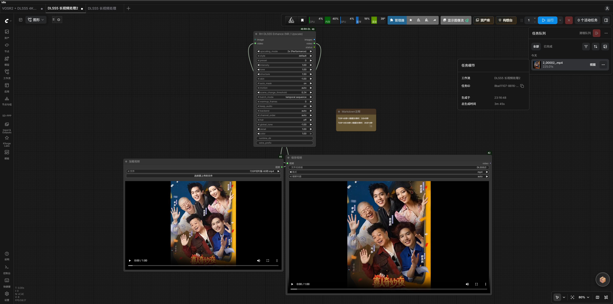
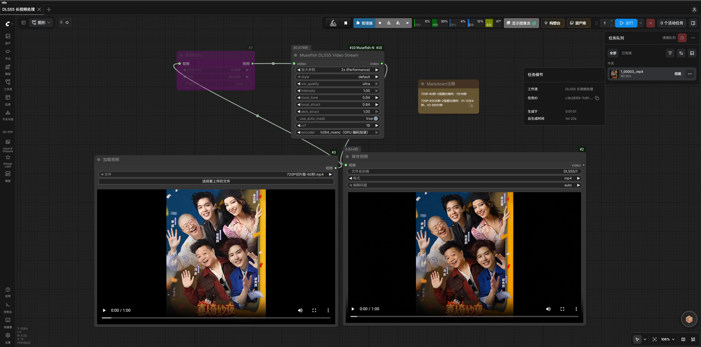

# ComfyUI-Musefish-Nodes

**English** | [简体中文](README.zh-CN.md)

Choose a workflow by purpose: PiD video upscaling and postprocessing, DLSS5 image/streaming video enhancement, social video downloading, or UniverSR audio upscaling and mastering. Their models, tuning parameters, and VRAM guidance are not interchangeable. Install this directory under `ComfyUI/custom_nodes/ComfyUI-Musefish-Nodes`, install the dependencies required by your workflow in ComfyUI's Python environment, and restart ComfyUI.

## New user guide: from installation to your first result

You need a working [ComfyUI installation](https://docs.comfy.org/get_started), Git (or the repository's **Code → Download ZIP**), and the **Python executable used to launch ComfyUI**. Install into the *running instance*, not another ComfyUI copy. Paths below are relative to its `ComfyUI` directory; substitute your own path. Do not install a separate PyTorch build over ComfyUI's CUDA environment.

1. **Install the repository.** Stop ComfyUI. In a terminal opened inside your `ComfyUI/custom_nodes` directory, run:

   ```bash
   git clone https://github.com/Brian98Z/ComfyUI-Musefish-Nodes.git
   ```

   No Git? Download the ZIP from the same repository, extract it into `custom_nodes`, and rename the extracted directory to `ComfyUI-Musefish-Nodes`. Check that `custom_nodes/ComfyUI-Musefish-Nodes/__init__.py` exists; an extra nested folder prevents discovery.

2. **Install dependencies in ComfyUI's Python, not system Python.** Find the executable in your ComfyUI launcher. For a Windows portable bundle whose layout is `ComfyUI_windows_portable/ComfyUI/` alongside `ComfyUI_windows_portable/python_embeded/`, open PowerShell in the `ComfyUI` directory and run:

   ```powershell
   & "../python_embeded/python.exe" -m pip install -r "custom_nodes/ComfyUI-Musefish-Nodes/requirements.txt"
   & "../python_embeded/python.exe" -m pip install opencv-python yt-dlp
   ```

   For a manually installed virtual environment, substitute its Python executable (for example `& "../.venv/Scripts/python.exe" -m pip ...` on Windows or `../.venv/bin/python -m pip ...` on Linux). Use the *actual path from your launcher*: portable packages may have different layouts. If `& "../python_embeded/python.exe" -c "import cv2"` already succeeds, install only `yt-dlp` in the second command; do not mix GUI and headless OpenCV variants. Torch and TorchAudio come from ComfyUI; leave them intact.

3. **Restart ComfyUI and check registration.** Open its web UI, double-click an empty canvas, search for **Musefish Video Download** (category `Musefish/Video`). If absent, read the ComfyUI startup console for the first plugin import error: confirm the install path and repeat step 2 with the launcher's Python. Updating Python packages without restarting does not reload the nodes.

4. **Run your first workflow (video download; no model or RTX 50 GPU required).** Install GitHub's [rgthree-comfy](https://github.com/rgthree/rgthree-comfy) custom node first if you want the optional group-bypasser controls in the bundled [download workflow](workflows/Musefish_Video_Downloader.json), then restart. Drag that JSON onto the ComfyUI canvas (or use **Workflow → Open**). The active branch is `MusefishVideoDownload → SaveVideo`; the WeChat branch is bypassed. Enter a **public, directly accessible Bilibili video URL** into `url`, leave `platform=Auto` and `quality=best`, then click **Queue Prompt**. A successful run writes a verified MP4 under `ComfyUI/output/musefish/`; `SaveVideo` also writes its output under `ComfyUI/output/`. If the site requests login or blocks downloads, use a video you are permitted to download and follow the [platform/cookie troubleshooting guide](doc/VIDEO_DOWNLOAD_README.en.md); do not treat a blocked URL as an installation failure. Alternatively, add `Musefish Video Download` and `SaveVideo` manually and connect `video → video`, avoiding the optional rgthree node.

5. **Set up the processing workflow you actually want.** Use the download/placement checklist below, then load the corresponding JSON under `workflows/`. Replace example inputs (`抖音热舞.mp4`, `video-2.mp4`, `测试歌曲.mp3`, `测试语音.wav`) with your own uploaded files. Missing models do not come with the repository; the downloader's first run above needs none.

### Model and dependency download/placement checklist

All `ComfyUI/` paths refer to the *same instance you launch*. If ComfyUI uses `--models-directory`, put model/DLL files under that configured directory instead. Retain the subfolders below so the example loader selections resolve; restart after installing node packs or DLLs and refresh the browser after loading new models.

| Workflow | Download / installation | Exact destination and first-run check |
| --- | --- | --- |
| **PiD video upscale** | Download the PiD UNET and PixelDiT CLIP from [Comfy-Org PixelDiT](https://www.modelscope.cn/models/Comfy-Org/PixelDiT/files), and the encode VAE from [Comfy-Org z_image_turbo VAE files](https://www.modelscope.cn/models/Comfy-Org/z_image_turbo/tree/master/split_files/vae). Install [VideoHelperSuite](https://github.com/Kosinkadink/ComfyUI-VideoHelperSuite) under `custom_nodes/` for the bundled video-combine template. | `ComfyUI/models/diffusion_models/PiD/pid_1.5_flux1_1024_to_4096_4step_int8_convrot.safetensors`, `ComfyUI/models/text_encoders/PixelDiT/gemma_2_2b_it_elm_fp8_scaled.safetensors`, `ComfyUI/models/vae/Flux/UltraFlux-v1-vae.safetensors` (on older ComfyUI builds, UNETLoader/CLIPLoader may use `models/unet`/`models/clip`; use the actual folders shown by your ComfyUI loaders). Open [PiD workflow](workflows/Musefish_PiD_Batch_Video_Upscale.json), select those three files in UNETLoader/CLIPLoader/VAELoader and your own video in LoadVideo; set `frame_load_cap=2` and `batch_size=1` for the initial run. Deliver the postprocessed `IMAGE` via the video-combine node, not raw PiD `VIDEO`. [Full PiD guide](doc/PiD_README.en.md). |
| **UniverSR audio** | General: [woongzip1/universr-audio](https://huggingface.co/woongzip1/universr-audio/tree/main); speech: [woongzip1/universr-speech](https://huggingface.co/woongzip1/universr-speech/tree/main). Easiest: in `Musefish UniverSR Model`, select `general` or `speech` and set `download=true` on first run (default `HF_ENDPOINT=https://hf-mirror.com`); alternatively download **both** `config.yaml` and `pytorch_model.bin` from each repo manually. The bundled template additionally uses [rgthree-comfy](https://github.com/rgthree/rgthree-comfy) and [ComfyUI-Custom-Scripts](https://github.com/pythongosssss/ComfyUI-Custom-Scripts); `stem_mix` additionally needs `<comfy-python> -m pip install demucs` and both model sets. | General files: `ComfyUI/models/UniverSR/models/huggingface/general/{config.yaml,pytorch_model.bin}`; speech files: corresponding `speech/` directory. Open [audio workflow](workflows/Musefish_UniverSR_Audio.json), upload your own audio to the enabled music branch, leave the matching model cache connected, run once, then set `download=false` for offline reuse. For `stem_mix`, point `model_cache` to the `huggingface/` parent containing **both** directories. [Full audio guide](doc/UNIVERSR_README.en.md). |
| **DLSS5 image / video** | **RTX 50-series only.** Install a matching [NVIDIA driver](https://www.nvidia.com/Download/index.aspx). Obtain the four DLLs from a legitimately obtained DLSS5Tool package or the [user-provided four-file share](https://pan.quark.cn/s/d4c04dc33d25) **only after checking license and provenance**; this is *not* an official NVIDIA download and no verified official standalone source exists. Streaming VIDEO additionally needs [FFmpeg](https://ffmpeg.org/download.html): extract a Windows build and add its `bin/` containing `ffmpeg.exe` and `ffprobe.exe` to the PATH of the process launching ComfyUI. | Put `dlssnr_host.dll`, `nvngx_dlssnr.dll`, `vsr_host.dll`, `nvngx_vsr.dll` directly in `ComfyUI/models/dlss5/` (not the plugin folder). Without the two VSR DLLs, >1× is unavailable. Verify `ffmpeg -version` and `ffprobe -version` in the *launcher environment*, restart ComfyUI, then open [stream workflow](workflows/Musefish_DLSS5_Video_Stream.json), replace LoadVideo's sample filename with your uploaded short clip, and queue at `2× (Balance)`; use a small clip first. Do not install a separate CUDA Toolkit or replace ComfyUI's PyTorch. [Full DLSS5 guide](doc/DLSS5_README.en.md). |
| **Downloader / WeChat** | Install `yt-dlp` in ComfyUI's Python as in step 2. The bundled WASM/Node toolchain supports WeChat but requires its desktop client to be running and the target video played; some platform URLs require your own local proxy/cookies. | No model weights. For direct download use `Musefish Video Download → SaveVideo` as in step 4; if the source blocks bots, review [platform-specific credentials and proxy setup](doc/VIDEO_DOWNLOAD_README.en.md). Never commit cookie files or tokenized URLs. |

**Before troubleshooting model code:** if a loader lists no weights, recheck the directory, exact filename and active models root; if a workflow shows red/missing nodes, install the named custom-node pack under the same `custom_nodes/` and restart; if only the downloaded media fails, inspect the URL/credentials; if DLSS5 VIDEO reports `ffmpeg and ffprobe must both be available on PATH`, set the launcher's PATH, not merely your interactive terminal's. Availability of external model hosts and third-party DLL licensing is outside this repository's control.

## Choose a workflow

| Purpose and nodes | Highlights | Key parameters and constraints | Full guide |
| --- | --- | --- | --- |
| PiD: `MusefishPiDBatchVideoUpscale`, `AutoBatchAntiflicker`, `AutoBatchImageSharpenFS` | Fixed 1024→4096 PiD model path; stable noise reused across batches; temporal filtering with adjacent-frame context; batched frequency-separation sharpening with CPU fallback | Start with PiD `steps=4`, `sampler=lcm`, `latent_format=flux`; antiflicker `luma_tmp=15`, `chroma_tmp=20`. Portrait sharpening: `hard/gaussian/6`, `amount=0.45`, `noise_threshold=0.01`. Encode the **postprocessed IMAGE output**, not PiD's raw VIDEO output | [PiD and postprocessing](doc/PiD_README.en.md) |
| DLSS5: `MusefishDLSS5NeuralRender`, `MusefishDLSS5VideoStream` | IMAGE batches or continuous file-backed VIDEO; incompatible scales hidden when source dimensions are known; enhancement at ≤4K before final 8K resizing | **RTX 50-series only**; proprietary runtimes must be provided separately. `Upscale` selects output size; `vsr_quality` separately selects VSR quality. IMAGE float32 batches are capped at 1 GiB. Streaming VIDEO switches CPU/GPU encoders to HEVC `libx265`/`hevc_nvenc` above 4096 px in either dimension; CPU default `crf=19`, GPU fixed CQ 27. An 8K output is not native 8K neural-render detail | [DLSS5 setup and controls](doc/DLSS5_README.en.md) |
| Download: `MusefishVideoDownload`, `MusefishWeChatChannels` | YouTube, Bilibili, X, Douyin, Xiaohongshu, and local WeChat Channels retrieval/decryption; returns file-backed VIDEO and FPS | `url`, `platform=Auto`, `quality=best`, `chunks` (supported platforms can auto-select 8); YouTube/X require a local proxy and YouTube/Douyin may need local cookies. Keep the WeChat client open playing the target. Cookie files and cached token-bearing URLs are credentials; never publish them | [Platforms, credentials and decryption](doc/VIDEO_DOWNLOAD_README.en.md) |
| Audio: `MusefishUniverSRModel`, `MusefishUniverSRGeneralAudio`, `MusefishUniverSRSpeechAudio` | General music/SFX restoration and mastering, speech enhancement, content-aware settings and chunked inference | Models live under `ComfyUI/models/UniverSR/models/huggingface/<general\|speech>`; download occurs only with `download=true`. New-node defaults: `auto_params=true`, `input_sr=auto`, `ode_steps=4`, `guidance=1.5`, `chunk_sec=15`, `accel=cuDNN TF32`. Reduce `chunk_sec` if VRAM is low. `stem_mix` requires both models and Demucs | [UniverSR audio and mastering](doc/UNIVERSR_README.en.md) |

## Dependencies and models

- Shared Python dependencies are listed in [`requirements.txt`](requirements.txt). **DLSS5** additionally uses ComfyUI's CUDA/PyTorch, OpenCV, and an RTX 50-series driver. Scaling above 1× requires the two VSR runtimes as well. Place the four proprietary DLLs under `ComfyUI/models/dlss5/`; they are **not shipped** in this repository. The [user-provided file share](https://pan.quark.cn/s/d4c04dc33d25) is **not an official NVIDIA distribution**; verify the license and filenames before use. See [DLSS5 deployment](doc/DLSS5_README.en.md). Streaming VIDEO also requires both `ffmpeg` and `ffprobe` on `PATH`; [FFmpeg downloads](https://ffmpeg.org/download.html).
- **PiD UNET and CLIP:** [PixelDiT files](https://www.modelscope.cn/models/Comfy-Org/PixelDiT/files); **encode VAE:** [z-image/flux1 VAE files](https://www.modelscope.cn/models/Comfy-Org/z_image_turbo/tree/master/split_files/vae). See [exact model filenames and loader options](doc/PiD_README.en.md).
- **UniverSR** needs both `config.yaml` and `pytorch_model.bin` for each general/speech model. The model node downloads only if `download=true`, using `HF_ENDPOINT` (default `https://hf-mirror.com`). See [cache layout and processing modes](doc/UNIVERSR_README.en.md).
- Downloader workflows use yt-dlp. WeChat Channels also requires the local client and the bundled wasm/Node decryption tools. See [proxy, cookie and security requirements](doc/VIDEO_DOWNLOAD_README.en.md).

## Example workflows

| Workflow | Before running |
| --- | --- |
| [PiD upscale and postprocess](workflows/Musefish_PiD_Batch_Video_Upscale.json) | Supply the UNET/CLIP/VAE and source video; start with small batches on a 16 GB GPU |
| [DLSS5 streaming video](workflows/Musefish_DLSS5_Video_Stream.json) | `LoadVideo → MusefishDLSS5VideoStream → SaveVideo`; select your source file first; defaults to 2× and CPU encoding |
| [UniverSR music and speech](workflows/Musefish_UniverSR_Audio.json) | A 16 GB reference with two separate branches; replace test audio and enable the intended branch; additionally requires rgthree and ComfyUI-Custom-Scripts |
| [Video downloader](workflows/Musefish_Video_Downloader.json) | Supply the share link/platform; for WeChat Channels, play the desired video in the client first |

## DLSS5 speed snapshot: RunningHub vs Musefish

Two user-provided RunningHub task screenshots label their input as the same **720p, 60-second clip** at **2×**. The RunningHub **RH DLSS5 Enhance (NR / Upscale)** task shows **225.01 s (3m 45s)**; **Musefish DLSS5 Video Stream** shows **80.92 s (1m 20s)**—**about 2.78× less elapsed task time** in these screenshots. This is a concrete example, not a controlled node-only benchmark: the screenshots show different enhancement controls, Musefish explicitly uses GPU H.264 encoding, and hardware/backend/queue overhead cannot all be verified from the images. Do not extrapolate the ratio to other clips or installations. [Comparison context](doc/DLSS5_README.en.md#runninghub-versus-musefish-task-snapshot).

| RunningHub task | Musefish task |
| --- | --- |
|  |  |

## Limits and releases

- PiD/UniverSR 16 GB presets are references, not OOM guarantees. Long PiD batches still consume host RAM. For long DLSS5 video, use the file-backed streaming node rather than one large IMAGE batch.
- For the **same 1080p, 22-second video enlarged to 8K**, the user measured **79 seconds with GPU HEVC** and **300 seconds with CPU HEVC**. This is a single-source/hardware comparison, not a general throughput guarantee. [Quality and encoder details](doc/DLSS5_README.en.md).
- **v1.5.0 (2026-09-28):** English `Upscale` labels, source-resolution option filtering, stable 8K enhancement, CPU HEVC support, and a streaming workflow template. The detailed guides retain implementation history and measurements. [GitHub v1.5.0 release](https://github.com/Brian98Z/ComfyUI-Musefish-Nodes/releases/tag/v1.5.0).
