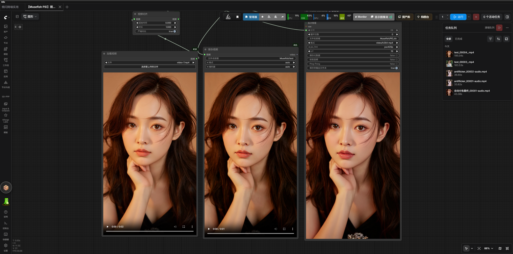

# PiD Video Upscaling and Postprocessing

## Features and Quick Start

- **`Musefish PiD Batch Video Upscale`**: 4× PiD video upscaling (fixed 1024 → 4096 path), reusing the same noise template across batches to keep frames temporally stable.
- **`AutoBatch Antiflicker`**: Symmetric temporal bilateral filtering suppresses flicker without smearing motion edges; `frames_per_batch=0` enables automatic batching and `device=auto` enables CPU offload.
- **`AutoBatch Image Sharpen FS`**: Frequency-separation sharpening (`hard`/`linear light`) for soft edges in 4K upscales; also supports automatic batching and CPU offload.

**Quick start:** PiD upscale output → `AutoBatch Antiflicker` → `AutoBatch Image Sharpen FS` → `VHS_VideoCombine`. For portraits, use the template's low-halo settings: excessive sharpening can turn hairlines, eyelids, and cheek contours into grainy, fragmented edges.

Example template workflow: `workflows/Musefish_PiD_Batch_Video_Upscale.json` (UUID: `d7de7df1-0bb0-4cf8-bb1e-6f7ee7c5d1d2`). The template connects `AutoBatchAntiflicker` after PiD, followed by adaptive sharpening and video combination.

### AutoBatch Antiflicker

Node ID: `AutoBatchAntiflicker`

**Function:** Applies symmetric, brightness-guided temporal bilateral filtering across preceding and following frames in an `IMAGE` batch. It suppresses local flicker while rejecting motion edges, avoiding the trails caused by one-way temporal recursion. Implemented in `musefish_nodes.py`; it does not depend on or modify `VideoHelperSuite`.

#### Automatic Batching and Device Offload

- Filtering tensor operations run on the selected device (GPU or CPU). Input frames are transferred in chunks and returned to the input device after processing, preserving downstream behavior.
- **Automatic batching:** The number of frames per batch is calculated from currently available device memory (VRAM on GPU, system memory on CPU). The entire video is not kept resident in VRAM or system memory together with neighbor copies and weight tensors. `frames_per_batch` can instead be set to a fixed batch size.
- **Device offload:** With `device=auto`, GPU is preferred; if VRAM cannot fit even one frame, processing automatically falls back to CPU. You can also force `gpu` or `cpu`.
- Each chunk overlaps with one context frame on either side. Every frame in a chunk can see its actual temporal neighbors, preventing seams at chunk boundaries.

Recommended connections:

```text
VHS_LoadVideo IMAGE ──→ AutoBatchAntiflicker ──→ VHS_VideoCombine IMAGE
VHS_LoadVideo AUDIO ─────────────────────────→ VHS_VideoCombine audio
```

Parameters:

| Parameter | Default | Description |
| --- | ---: | --- |
| `luma_tmp` | `15` | Temporal brightness-similarity width. Increasing it can reduce brightness flicker, but excessive values reduce motion-texture stability. |
| `chroma_tmp` | `20` | Temporal chroma-similarity width, for background color changes. Usually there is no need to exceed `20`. |
| `frames_per_batch` | `0` | Frames processed per batch; `0` = calculate automatically from currently available device memory. |
| `device` | `auto` | Compute device: `auto` (GPU first, automatically falls back to CPU if VRAM is insufficient) / `gpu` / `cpu`. |

Recommended starting values are `15/20` and `device=auto`. The 16 GB reference template uses `frames_per_batch=1` for a bounded VRAM peak; setting it to `0` estimates the batch size from currently available memory. The algorithm uses neighboring source frames and does not recursively propagate history, but check for trails during fast motion. The template retains broadly compatible H.264 `yuv420p`; for 10-bit output, choose a separately supported encoder rather than changing only the pixel format.

If the subject shows trails, first lower `luma_tmp`. If only background colors flicker, leave the brightness setting unchanged and raise `chroma_tmp` alone. Do not raise both parameters substantially at the same time.

### AutoBatch Image Sharpen FS

Node ID: `AutoBatchImageSharpenFS`

**Function:** Float-based frequency-separation sharpening. It uses float32 batched computation, soft thresholding, and luminance-gradient edge protection to reduce amplification of low-amplitude noise and contour high frequencies. It is no longer pixel-for-pixel equivalent to the old RES4LYF output.

Processing:

```text
low_pass  = floating-point median/gaussian blur(images, intensity)  # CPU
detail    = hard/linear light blend result - images                  # float32
output    = clamp(images + amount × soft_threshold(detail) × edge_protection, 0, 1)
```

#### Automatic Batching and Device Offload

- Float32 operations are batched using a conservative available-memory budget; the antiflicker budget also accounts for preceding and following neighbor frames. Output is preallocated to avoid an extra full-length copy from `list + cat`.
- On out-of-memory errors, the current batch is reduced and retried without skipping frames. `auto` can fall back to CPU after a single-frame GPU OOM; explicit `gpu` does not silently switch devices. Other errors and user interrupts continue to propagate.
- Gaussian uses OpenCV floating-point low-pass filtering. Small-kernel median uses OpenCV; large-kernel median uses SciPy floating-point median filtering to avoid uint8 round-trip quantization. Large median kernels may be substantially slower; Gaussian is recommended by default for portraits.

Parameters:

| Parameter | Default | Description |
| --- | ---: | --- |
| `method` | `hard` | Blend method: `hard` (hard light) / `linear` (linear light). |
| `blur_type` | `median` | Low-pass method: `median` (edge-preserving) / `gaussian`. |
| `intensity` | `6` | Determines the low-pass kernel size: at least 3, made odd based on intensity − 1. It is not the sharpening blend strength. |
| `frames_per_batch` | `0` | Frames processed per batch; `0` = calculate automatically from currently available device memory. |
| `device` | `auto` | Compute device: `auto` / `gpu` / `cpu`. |
| `amount` | `1.0` | Sharpening-residual blend strength, 0–2; portrait template uses **0.45**; 0 disables enhancement. |
| `noise_threshold` | `0.0` | Soft threshold for residuals, range 0–1; portrait template uses **0.01**, so texture below the threshold is not additionally enhanced. |

Portrait reference: `hard / gaussian / 6 / 1 / auto`, with `amount=0.45` and `noise_threshold=0.01`. Inspect hairlines, eyelids, and cheek edges first, then raise `amount` only slightly if needed; do not create an artificial impression of sharpness with aggressive `median/12`. This processing suppresses sharpening-induced halos; it does not guarantee removal of every model-generated artifact or restore real detail absent from the source.

### Example Results

The following is a **historical result from an older configuration**: the original 480×832 video (33 frames, about 2 seconds) was upscaled 4× by PiD to **2304×4096**, then processed with antiflicker and `hard/median/12` sharpening. These historical assets are retained for comparison and do not represent the current portrait recommendation.

| Example | File |
| --- | --- |
| Original video | [案例-原视频.mp4](../assets/案例-原视频.mp4) |
| 4× upscale + postprocessing | [案例-4倍超分.mp4](../assets/案例-4倍超分.mp4) |



> The upscaled video is 4K portrait (2304×4096) and the file is large. After downloading, view it in a local media player or editing software. For detail comparisons, focus on hair strands, clothing texture, and the sharpness of subject-edge lines.

### Template Workflow Structure

The current `Musefish_PiD_Batch_Video_Upscale.json` template processes video in this order:

```text
LoadVideo
  ├── IMAGE → Musefish PiD Batch Video Upscale
  ├── AUDIO ───────────────────────────────┐
  └── FPS ─────────────────────────────────┤
                                           ▼
Musefish PiD Batch Video Upscale → AutoBatch Antiflicker(15/20/1/auto)
                                  → AutoBatch Image Sharpen FS(hard/gaussian/6/1/auto, amount=0.45, noise_threshold=0.01)
                                  → VHS_VideoCombine(yuv420p)
```

PiD's original `VIDEO` output does not pass through the subsequent image-processing nodes. For the final deliverable, use the `VHS_VideoCombine` output generated from the processed `IMAGE` path.

### Nodes

#### Musefish PiD Batch Video Upscale

Node ID: `MusefishPiDBatchVideoUpscale`

**Function:** Sends `IMAGE` frames from a video loader to the PiD model in batches and outputs upscaled `VIDEO` and `IMAGE` frames in their original order. Optional audio and input frame rate are carried into the `VIDEO` output.

During one execution, the node:

1. Resizes input frames to a uniform 1024-pixel long edge using its built-in setting.
2. Encodes the low-resolution frames with the input VAE.
3. Runs PiD sampling in batches controlled by `batch_size`.
4. Maps the PiD pixel-space sampling result directly from [-1,1] to [0,1] as CPU float32, without decoding a VAE.
5. Combines all frames while preserving audio and FPS.

VAE pre-encoding and PiD sampling run separately to avoid repeatedly loading and unloading models for each batch. Low-resolution latents are staged on the CPU and released after use; 4K output is written directly to a preallocated CPU tensor. Sampling uses ComfyUI's standard memory management and does not force all models to stay resident. If VAE or sampling runs out of memory, the current batch is halved while retaining the same-seed noise and frame order; if even a single frame fails, the node reports an explicit error. PiD uses full-frame inference and does not introduce unverified spatial tiling that could create seams.

**About `pixel_chunk_size`:** This limits the independent patch MLP branch in the pixel Transformer; attention still processes the full-frame sequence. Smaller chunks add kernel-call overhead, so smaller is not always better. The default is `1024` (`2048` provides no meaningful end-to-end gain).

**`attention_backend` (default `Kitchen`):** Affects only sampling in this node's current execution and does not change ComfyUI's global attention. `Kitchen` (Comfy Kitchen int8 attention) has lower latency, but VRAM use depends on shape and batch size; it cannot be generally described as more memory-efficient. Quantization and rounding mean its output can differ numerically from the PyTorch/cuDNN path, with no guarantee of pixel-for-pixel equivalence. If the current build does not provide `Kitchen`, the node logs this and automatically falls back to `cuDNN`.

**Same-condition short-clip measurements (to inform trade-offs, not a speed guarantee for all content):**

| Scenario | Settings | Observation |
| --- | --- | --- |
| PiD node, Kitchen | 2 frames, 2304×4096, same model, 4 steps, seed=0, batch=2, `pixel_chunk_size=1024` | 13.7346 seconds; 9.72 GiB allocated VRAM. |
| PiD node, cuDNN | Same as above | 21.1101 seconds; 8.57 GiB allocated VRAM. |
| Kitchen vs. cuDNN | Same conditions above | About 35% lower latency, or approximately 1.54×; this is the result under these measured conditions, not a general acceleration guarantee. |
| Old two-frame Kitchen visual comparison | Short-clip comparison | PSNR 51.6–51.8 dB; outputs are not pixel-identical, and no conclusion has been established for long-motion quality. |
| Batch=3 retest | 6 frames, same model and sampling settings | 79.62 seconds, 12.81 GiB allocated and 15.64 GiB reserved; output differs from batch=2. Not recommended on a 16 GB GPU. |
| Reverse-order `pixel_chunk_size` retest | 6 frames, 2048 vs. 1024 | 57.82 vs. 58.09 seconds (about 0.46% difference); the six-frame results were the same, so 1024 is retained. |

These figures come from short clips and fixed settings and are only for comparing trade-offs. Resolution, batch size, device, model-loading state, and source content all affect runtime and memory use; these are not speed guarantees. `Kitchen` and `cuDNN` outputs are not guaranteed to be pixel-identical, and motion quality on long videos must be checked separately.

#### Logs and Result Boundaries (FAQ)

- **Why does `Model Initialization complete` appear for every batch?** It is a generic suffix attached to the first DynamicVRAM tqdm update. Preparation does run for every batch, but this text is not evidence that weights are reloaded from disk for every batch.
- **How should I choose a backend?** Use `Kitchen` by default. If the current build lacks Kitchen, the node logs the issue and falls back to `cuDNN`. You can also explicitly select `cuDNN`; this override applies only to this node's current execution and does not alter global attention.

### Recommended Connections

```text
VHS_LoadVideo
  ├── IMAGE ───────────────┐
  ├── AUDIO ───────────────┤
  └── VHS_VIDEOINFO.FPS ───┤
                            ▼
Musefish PiD Batch Video Upscale
  ├── MODEL      ← UNETLoader
  ├── CLIP       ← CLIPLoader(type=pixeldit)
  ├── encode_vae ← VAELoader(Flux\UltraFlux-v1-vae.safetensors)
  └── pixel output decode ← float32 mapping inside the node; no VAE needed
                            │
                            ├── VIDEO → SaveVideo
                            └── IMAGE → preview or video-combine node
```

#### Color Correction and Flicker Suppression

The example workflow adds `ColorMatchToReference` after PiD output and uses `ImageFromBatch(batch_index=0, length=1)` to select the first input-video frame as a fixed reference:

```text
VHS_LoadVideo ──→ ImageFromBatch(first frame) ──→ ColorMatchToReference.reference_image
Musefish PiD ──────────────────────────────────→ ColorMatchToReference.images
ColorMatchToReference ─────────────────────────→ VHS_VideoCombine
```

The defaults are `match_strength=0.85` and `batch_size=4`. Using a fixed first-frame reference pulls each upscaled frame's LAB mean and standard deviation toward the same color baseline, targeting flicker caused by frame-to-frame PiD color shifts. It cannot fix brightness or content flicker already present in the input video. To disable correction, disconnect the color-matching node and connect PiD output directly to the video-combine node.

After color matching, connect the result from PiD's `IMAGE` output to `VHS_VideoCombine`; PiD's `VIDEO` output remains the original video object and does not pass through external color nodes.

`encode_vae` is the only VAE input that needs to be connected. PiD predicts pixel-space data directly; output uses float32 mapping to avoid the old `pixel_space` VAE scheduling and intermediate low-precision rounding.

| Parameter | Recommended value |
| --- | ---: |
| `batch_size` | Start at `1`; increase to `2` or `4` if VRAM allows. |
| `pixel_chunk_size` | **1024**; 0 disables the internal optimization. Smaller values reduce peak MLP activations but may be slower. |
| `attention_backend` | **`Kitchen`**; if Kitchen is unavailable, a log entry is recorded and the node falls back to `cuDNN`. |
| `upscale_factor` | `4` |
| `latent_format` | `flux` |
| `degrade_sigma` | `0.0` |
| `cfg` | `1.0` |
| `sampler_name` | `lcm` |
| `scheduler` | `simple` |
| `steps` | `4` |
| `positive_prompt` | `high quality, ultra detailed, sharp details` |

The model always first resizes the input frame's long edge to `1024` and performs fixed `1024 → 4096` upscaling. `upscale_factor` controls only the final delivery size: setting it to `2` produces 4096 internally and then downsizes to 2048; `3` downsizes to 3072; `4` outputs 4096 directly.

When enlarging input frames to model size, floating-point `bicubic` is used to avoid the uint8 round-trip quantization of PIL Lanczos. Downscaling to model size and 2×/3× delivery resizing still use `area`. Values are clamped to [0,1] before encoding to prevent interpolation overshoot. This change does not add sampling steps or reduce the resolution of the 1024→4096 model path.

The model input size is an internal constraint and does not need to be set by the user.

Recommended models:

```text
UNET:
PiD\pid_1.5_flux1_1024_to_4096_4step_int8_convrot.safetensors

CLIP:
PixelDiT\gemma_2_2b_it_elm_fp8_scaled.safetensors

encode_vae:
Flux\UltraFlux-v1-vae.safetensors

decode VAE:
Not required: the node directly maps pixel-space data in float32.
```

Model downloads:

- **UNET and CLIP (PixelDiT/PiD series):** <https://www.modelscope.cn/models/Comfy-Org/PixelDiT/files>
- **VAE (`encode_vae`, compatible with z-image/flux1):** <https://www.modelscope.cn/models/Comfy-Org/z_image_turbo/tree/master/split_files/vae>

### Long-Video Processing Recommendations

- First set `VHS_LoadVideo.frame_load_cap` to a small number of frames, for example `2` or `4`, to validate the setup.
- After confirming output size and model parameters, increase the frame count.
- If PiD upscaling runs out of VRAM, lower `batch_size` first; do not change frame order.
- Postprocessing supports automatic batching and smaller-batch retries after OOM, but still requires the full CPU input/output to be stored. It is not an unlimited-length streaming pipeline. If system memory is insufficient, shorten the clip at the loader. When VRAM is tight, use `frames_per_batch=1` first or explicitly set `device=cpu`.
- Model input is fixed to a 1024-pixel long edge. `upscale_factor=2/3/4` delivers approximately 2048/3072/4096 pixels on the long edge; model computation remains fixed to the 4× path.
- Connect the `VIDEO` output to `SaveVideo`; ComfyUI handles encoding and audio saving.

### Video Stability

Each node execution generates one fixed random-noise template and reuses it across all frame batches. Changing `batch_size` does not change the random-noise sequence assigned to frames, avoiding obvious flicker at batch boundaries.

If local details still flicker:

- Keep `seed` fixed.
- Use `batch_size=1` to verify the model and VAE configuration first.
- Confirm that `encode_vae` uses `Flux\UltraFlux-v1-vae.safetensors`.
- Confirm that input frames have not been heavily subsampled using `force_rate` or `select_every_nth`.
- Test with a 2–4-frame short clip before increasing the video length.

### Video-Related Files

- `musefish_nodes.py`: PiD upscaling, automatic-batch antiflicker, frequency-separation sharpening nodes, and extension registration.
- `pid_runtime.py`: Enables independent MLP chunking only for compatible PiD pixel patches; does not tile full-frame attention. Temporary patches to model-clone objects are restored after success, exceptions, and interrupts.
- [Musefish_PiD_Batch_Video_Upscale.json](../workflows/Musefish_PiD_Batch_Video_Upscale.json): Video upscaling and postprocessing template.
- Template UUID: `d7de7df1-0bb0-4cf8-bb1e-6f7ee7c5d1d2`.
